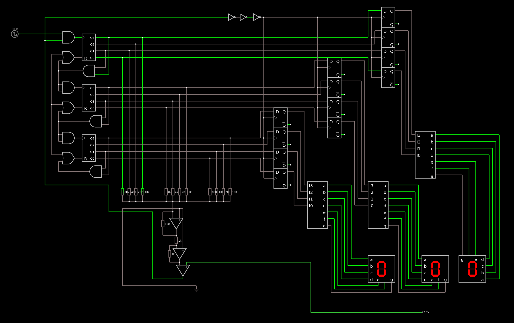

# ADC (Analog to Digital Converter)

Um simples voltímetro usando um ADC:

Apenas importe para o [falstad](https://www.falstad.com/circuit/circuitjs.html) como um texto o código que está aqui: [código](circuit.md)

