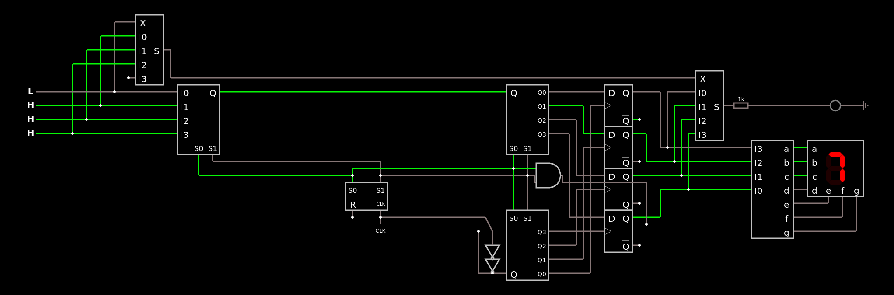

# Transmissão Digital com paridade

Um circuito que envia uma informção de 4 bits serialmente com paridade:

Apenas importe para o [falstad](https://www.falstad.com/circuit/circuitjs.html) como um texto o código que está aqui: [código](circuit.md)

