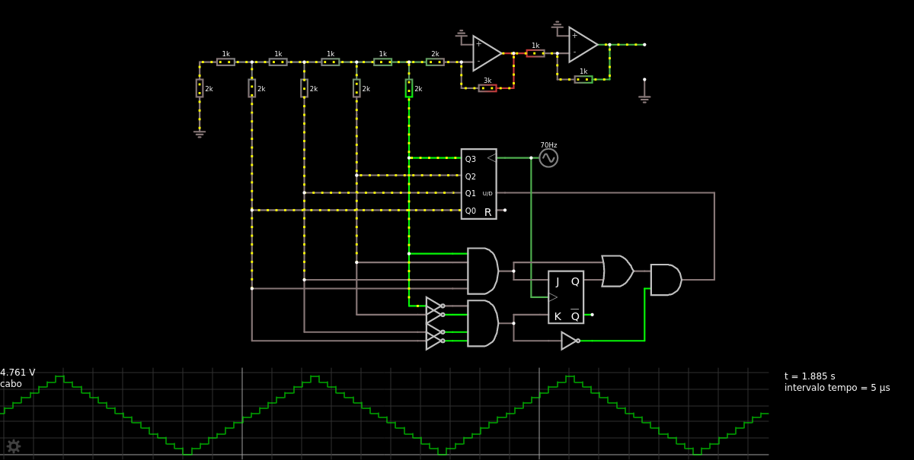
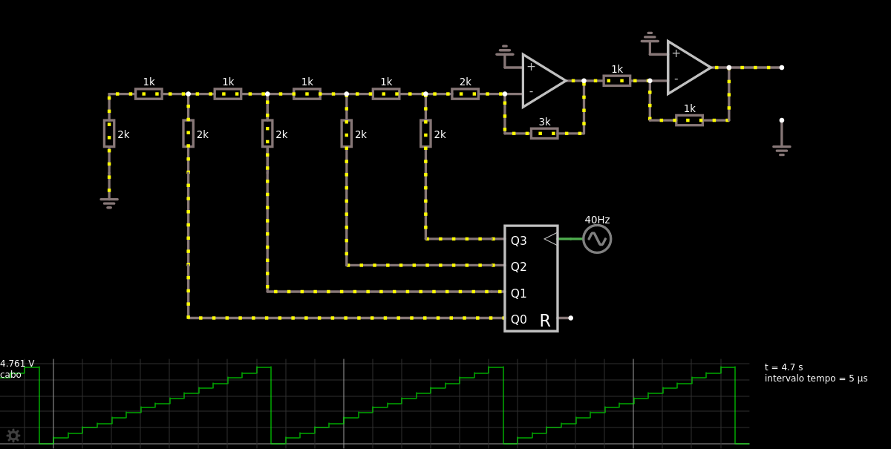

# Geração de sinais digitais

Como obter uma função triangular e dente de serra através de máquina de estados.

Apenas importe para o [falstad](https://www.falstad.com/circuit/circuitjs.html) como um texto o código que está aqui: [triangular](triangular.md) e [dente de serra](dente.md)

