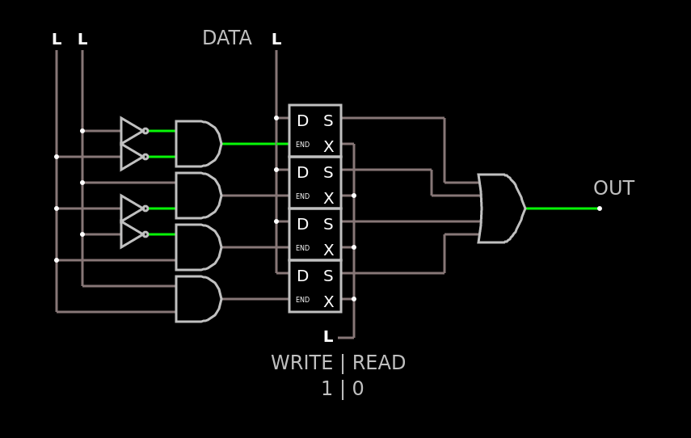

# Memória RAM

Um pequena memória RAM de 4 bits:

Apenas importe para o [falstad](https://www.falstad.com/circuit/circuitjs.html) como um texto o código abaixo:



```
$ 1 0.000005 10.20027730826997 50 5 43
x 359 359 412 362 4 24 1\s|\s0
x 696 111 747 114 4 24 OUT
x 297 327 464 330 4 24 WRITE\s|\sREAD
x 212 -75 273 -72 4 24 DATA
L 304 -48 304 -80 0 0 false 5 0
w 304 16 304 -48 0
L 400 288 368 288 0 0 false 5 0
L 64 -48 64 -80 0 0 false 5 0
L 32 -48 32 -80 0 0 false 5 0
w 32 256 160 256 0
w 32 192 32 256 0
w 64 224 160 224 0
w 32 192 160 192 0
w 32 128 32 192 0
w 64 160 64 224 0
w 64 160 96 160 0
I 96 160 160 160 0 0.5 5
w 32 128 96 128 0
w 32 64 32 128 0
w 64 96 64 160 0
w 64 96 160 96 0
I 96 128 160 128 0 0.5 5
w 32 64 96 64 0
w 64 32 64 96 0
w 64 32 96 32 0
w 64 32 64 -48 0
w 32 64 32 -48 0
I 96 32 160 32 0 0.5 5
I 96 64 160 64 0 0.5 5
w 624 128 704 128 0
w 256 240 304 240 0
w 256 176 304 176 0
w 256 112 304 112 0
w 256 48 304 48 0
150 160 112 256 112 0 2 0 5
150 160 48 256 48 0 2 5 5
150 160 176 256 176 0 2 0 5
150 160 240 256 240 0 2 0 5
w 496 112 544 112 0
w 512 16 400 16 0
w 512 96 512 16 0
w 544 96 512 96 0
w 496 80 496 112 0
w 400 80 496 80 0
w 400 144 544 144 0
w 512 160 544 160 0
w 512 208 512 160 0
w 400 208 512 208 0
w 400 176 400 240 0
w 400 112 400 176 0
w 400 48 400 112 0
w 400 240 400 288 0
152 544 128 624 128 0 4 5 5
w 304 144 304 208 0
w 304 80 304 144 0
w 304 16 304 80 0
. eeee 0 2 2 4 D 3 0 2 END 1 1 2 S 13 0 3 X 2 1 3 NandGateElm\s2\s4\s5\rNandGateElm\s6\s2\s7\rNandGateElm\s7\s8\s9\rNandGateElm\s9\s5\s8\rAndGateElm\s1\s3\s4\rAndGateElm\s15\s1\s6\rInverterElm\s3\s15\rAndGateElm\s8\s1\s13 0\\s2\\s5\\s5\s0\\s2\\s5\\s5\s0\\s2\\s5\\s5\s0\\s2\\s0\\s5\s0\\s2\\s0\\s5\s0\\s2\\s0\\s5\s0\\s0.5\\s5\s0\\s2\\s0\\s5
410 304 208 352 224 1 eeee 0\s2\s5\s5 0\s2\s5\s5 0\s2\s5\s5 0\s2\s0\s5 0\s2\s0\s5 0\s2\s0\s5 0\s0.5\s5 0\s2\s0\s5
410 304 144 352 160 1 eeee 0\s2\s5\s5 0\s2\s5\s5 0\s2\s5\s5 0\s2\s0\s5 0\s2\s0\s5 0\s2\s0\s5 0\s0.5\s5 0\s2\s0\s5
410 304 80 352 96 1 eeee 0\s2\s5\s5 0\s2\s5\s5 0\s2\s0\s5 0\s2\s5\s5 0\s2\s0\s5 0\s2\s0\s5 0\s0.5\s5 0\s2\s0\s5
410 304 16 352 32 1 eeee 0\s2\s5\s5 0\s2\s5\s5 0\s2\s0\s5 0\s2\s5\s5 0\s2\s0\s5 0\s2\s5\s5 0\s0.5\s5 0\s2\s5\s5
```