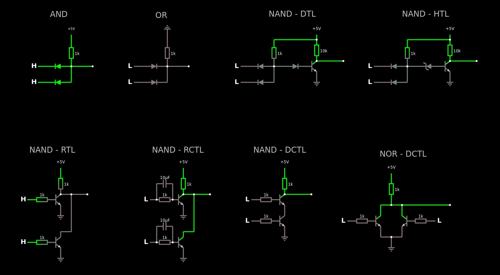
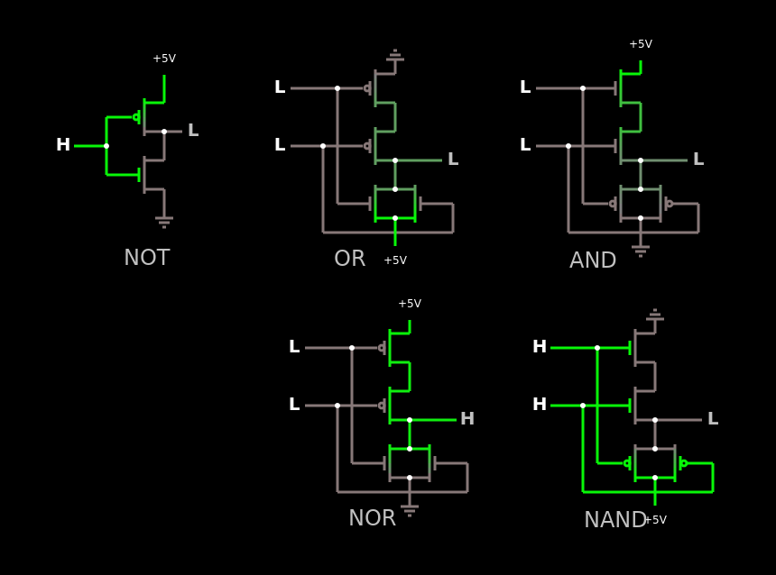

# Topologias portas lógicas

Circuito com algumas tecnologias de portas lógicas:

Apenas importe para o [falstad](https://www.falstad.com/circuit/circuitjs.html) como um texto o seguinte [código](transistor.md) para lógica a transistores TBJ, e importe este [código](mosfet.md) para lógica a MOSFET:

