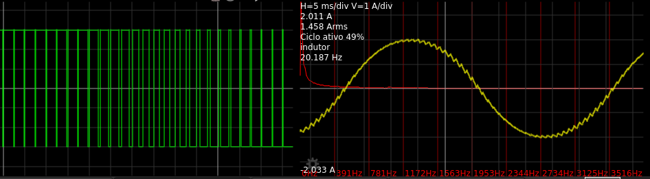
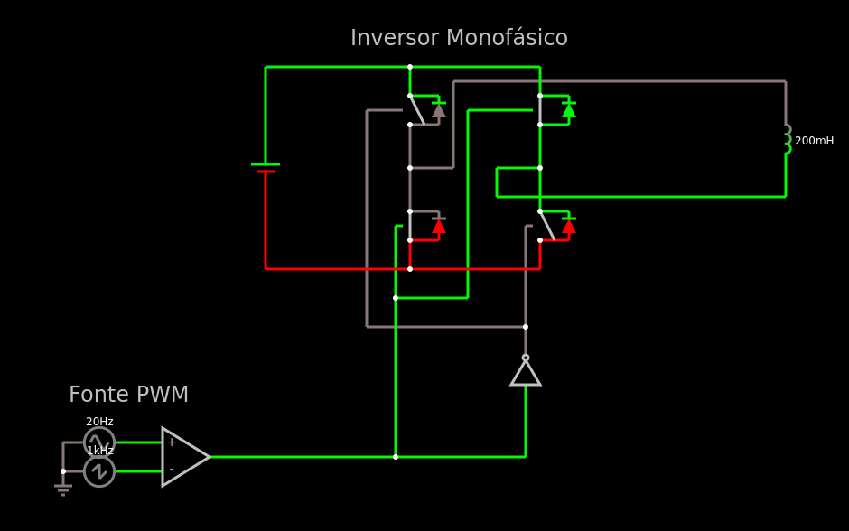

# Inversor de Frequência

Um simples inversor de frequência:

Apenas importe para o falstad




```
$ 1 0.000001 5.023272298708815 46 5 43
w 544 32 816 32 0
w 448 64 480 64 0
w 592 160 816 160 0
w 592 128 592 160 0
w 544 128 544 32 0
w 480 272 560 272 0
w 480 272 480 192 0
w 448 304 448 64 0
w 560 64 624 64 0
w 560 272 560 64 0
w 624 304 624 192 0
w 640 128 592 128 0
w 640 128 640 176 0
w 640 80 640 128 0
w 496 128 544 128 0
w 496 176 496 128 0
w 496 80 496 128 0
w 336 240 496 240 0
w 640 240 496 240 0
w 640 208 640 240 0
w 496 208 496 240 0
w 496 16 336 16 0
w 640 16 496 16 0
w 640 48 640 16 0
w 496 48 496 16 0
w 640 48 672 48 0
w 640 80 672 80 0
w 640 176 672 176 0
w 640 208 672 208 0
w 496 208 528 208 0
w 528 80 496 80 0
w 496 48 528 48 0
w 528 176 496 176 0
d 672 208 672 176 2 default
d 528 80 528 48 2 default
d 528 208 528 176 2 default
d 672 80 672 48 2 default
159 640 176 640 208 0 20 10000000000
159 496 176 496 208 0 20 10000000000
159 640 48 640 80 0 20 10000000000
159 496 48 496 80 0 20 10000000000
w 816 160 912 160 0
w 816 32 912 32 0
x 430 -8 671 -5 4 24 Inversor\sMonofásico
w 448 304 512 304 0
w 512 304 624 304 0
l 912 32 912 160 0 0.2 1.6894856121647501
x 118 387 251 390 4 24 Fonte\sPWM
w 480 272 480 448 0
I 624 400 624 304 0 0.5 5
w 624 400 624 448 0
w 624 448 480 448 0
a 192 448 304 448 9 15 -15 1000000 3.940000000360886 -8.898374773749254 100000
v 112 432 192 432 0 1 20 9 0 0 0.5
v 112 464 192 464 0 4 1000 10 0 0 0.5
w 112 432 112 464 0
g 112 464 112 480 0
w 304 448 368 448 0
w 368 448 480 448 0
v 336 240 336 16 0 0 40 100 0 0 0.5
o 49 64 0 4098 20 0.1 0 2 49 3
o 46 128 0 55049 160 3.2 1 2 46 3

```
