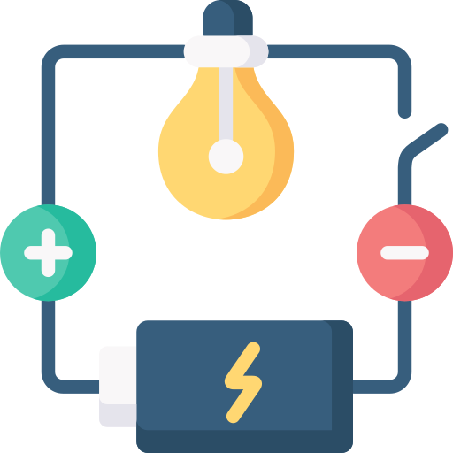

<h1 align="center">
   
  
   
  Circuitos Elétricos
   
</h1>

Olá, seja bem vindo a este repositório. Aqui eu tento documentar o que fiz em simuladores online enquanto estudava tópicos do curso de Engenharia Elétrica. Sinta-se a vontade para sugerir mudanças!

<h2 align="center">Clique nos ícones</h2>

<table>
  <tbody>
    <tr>
      <td align="center">Eletrônica 
        &nbsp;&nbsp;&nbsp;&nbsp;&nbsp;
      </td>
      <td align="center">&nbspPotência&nbsp 
        &nbsp;&nbsp;&nbsp;&nbsp;&nbsp;
      </td>
      <td align="center">&nbspControle&nbsp 
        &nbsp;&nbsp;&nbsp;&nbsp;&nbsp;
      </td>
      <td align="center">Comunicação 
        &nbsp;&nbsp;&nbsp;&nbsp;&nbsp;
      </td>
      <td align="center">Computação 
        &nbsp;&nbsp;&nbsp;&nbsp;&nbsp;
      </td>
    </tr>
    <tr>
        <td></td>
        <td></td>
        <td></td>
        <td></td>
        <td></td>
    </tr>
  </tbody>
</table>

<h2 align="center">Ou consulte a lista</h2>

### 1. [Eletrônica](https://github.com/taffarel55/digital-electronic/tree/master/Eletr%C3%B4nica)
- **Ceifadores e Grampeadores**: Exemplos de circuitos ceifadores e grapeadores.
- **Conversor Analógico Digital (ADC)**: Um voltímetro digital
- **Flip Flop SR:** Implementação de um FF SR com transistores TBJ e diodos
- **Geração de Sinais Digitais**: Gerador de ondas digitais (triangular e dente de serra)
- **Memória ROM**: Memória ROM utilizando matriz de diodos
- **Memória SRAM**: Memória SRAM de 4 bits
- **Portas Lógicas**: Implementação das tecnologias DTL, HTL, RTL, RCTL, DCTL e MOS
### 2. [Potência](https://github.com/taffarel55/digital-electronic/tree/master/Pot%C3%AAncia)
- **Inversor de frequência**: Inversor monofásico PWM
- **Paralelismo Transformadores**: Associação de um transformador Dyn11 com um Dyn1
### 3. [Controle](https://github.com/taffarel55/digital-electronic/tree/master/Controle)
- Breve!
### 4. [Comunicação](https://github.com/taffarel55/digital-electronic/tree/master/Comunica%C3%A7%C3%B5es)
- **Tramissão Serial Digital**: Transmissão serial de 4 bits com paridade.
### 5. [Computação](https://github.com/taffarel55/digital-electronic/tree/master/Computa%C3%A7%C3%A3o)
- Breve!

## Contribuindo

Pull requests são sempre bem vindos, posso ter esquecido de alguma coisa, ou me passado em algo. Se for uma mudança grande, abre uma Issue antes pra gente discutir as mudanças. Obrigado! 

## Licença

[GPL-3.0 License](LICENSE)

Icons made by <a href="https://www.freepik.com" title="Freepik">Freepik</a> from <a href="https://www.flaticon.com/" title="Flaticon">www.flaticon.com</a>

