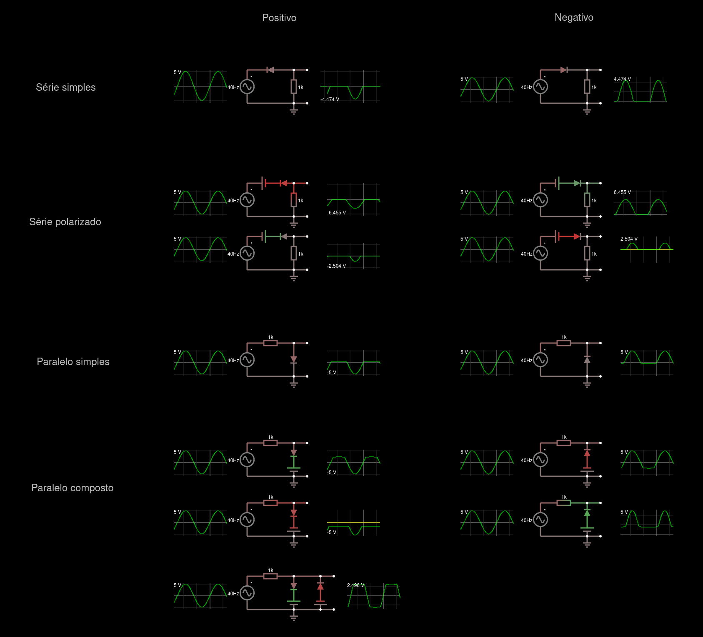

# Circuitos ceifadores e grampeadores

Exemplos de diversas topologias com exemplos de sinais de onda

Apenas importe para o [falstad](https://www.falstad.com/circuit/circuitjs.html) como um texto o código que está aqui: [ceifadores](ceifadores.md) e [grampeadores](grampeadores.md)

