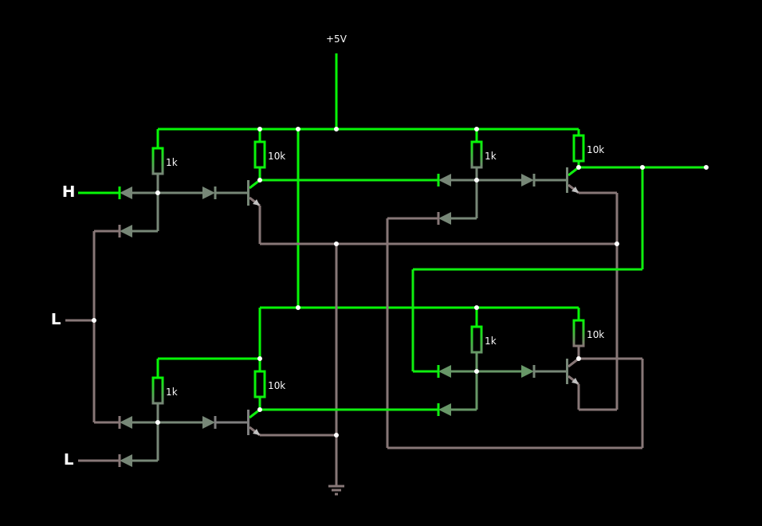

# FlipFlop SR

Apenas importe para o [falstad](https://www.falstad.com/circuit/circuitjs.html) como um texto o código abaixo:



```
$ 1 0.000005 3.9121283998153213 50 5 43
w 592 48 672 48 0
w 208 0 384 0 0
w 112 0 160 0 0
w 112 224 160 224 0
w 112 288 112 224 0
w 160 224 160 0 0
w 384 224 160 224 0
w 208 384 208 416 0
w 208 384 112 384 0
w 208 144 208 384 0
w 112 144 208 144 0
w 112 96 112 144 0
w 560 144 208 144 0
w 560 144 560 80 0
w 560 80 512 80 0
w 560 352 560 144 0
w 512 352 560 352 0
w 512 320 512 352 0
w 592 176 592 48 0
w 304 176 592 176 0
w 304 304 304 176 0
w 272 112 304 112 0
w 272 400 272 112 0
w 592 400 272 400 0
w 592 288 592 400 0
w -96 240 -96 368 0
w -96 128 -96 240 0
w 192 64 304 64 0
w 192 352 304 352 0
L -96 416 -128 416 0 0 false 5 0
w -16 368 16 368 0
w -16 416 -16 368 0
d -16 416 -96 416 2 default
d -16 368 -96 368 2 default
r -16 288 -16 368 0 1000
d 16 368 80 368 2 default
t 80 368 112 368 0 1 -4.447266298083271 0.47076227967182466 100
w 112 352 192 352 0
w -16 288 112 288 0
r 112 288 112 352 0 10000
L -96 80 -128 80 0 1 false 5 0
w -16 80 16 80 0
w -16 128 -16 80 0
d -16 128 -96 128 2 default
d -16 80 -96 80 2 default
r -16 0 -16 80 0 1000
d 16 80 80 80 2 default
t 80 80 112 80 0 1 -4.33712654120901 0.49030520094196683 100
g 208 416 208 448 0
w 112 64 192 64 0
w -16 0 112 0 0
r 112 0 112 64 0 10000
w 384 304 416 304 0
w 384 352 384 304 0
d 384 352 304 352 2 default
d 384 304 304 304 2 default
r 384 224 384 304 0 1000
d 416 304 480 304 2 default
t 480 304 512 304 0 1 0.6293931532094519 0.6605518504165369 100
w 512 288 592 288 0
w 384 224 512 224 0
r 512 224 512 288 0 10000
w 384 64 416 64 0
w 384 112 384 64 0
d 384 112 304 112 2 default
d 384 64 304 64 2 default
r 384 0 384 64 0 1000
R 208 0 208 -112 0 0 40 5 0 0 0.5
d 416 64 480 64 2 default
t 480 64 512 64 0 1 -4.1951981942320495 0.5047249481181107 100
w 512 48 592 48 0
w 384 0 512 0 0
r 512 0 512 48 0 10000
L -96 240 -144 240 0 0 false 5 0
w 208 0 160 0 0

```