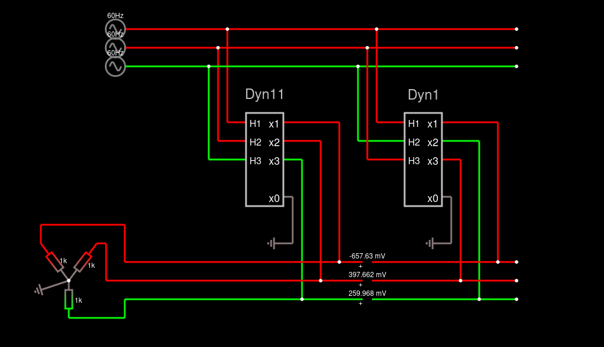

# Paralelismo transformadores

Exemplos de uma associação de dois transformadores trifásicos, um Dyn11 e outro Dyn1

Apenas importe para o [falstad](https://www.falstad.com/circuit/circuitjs.html) como um texto o código abaixo:



```
$ 1 0.000005 3.3115451958692312 50 5 43
. Dyn11 0 2 5 7 H1 5 0 2 H2 1 1 2 H3 3 2 2 x0 4 4 3 x1 6 0 3 x2 2 1 3 x3 7 2 3 TransformerElm\s1\s2\s3\s4\rTransformerElm\s5\s6\s1\s4\rTransformerElm\s3\s7\s5\s4 0\\s4\\s1\\s0\\s0\\s0.999\s0\\s4\\s1\\s0\\s0\\s0.999\s0\\s4\\s1\\s0\\s0\\s0.999
410 -560 -48 -560 -32 1 Dyn11 0\s4\s1\s0.25138059007000785\s-0.13769799533807914\s0.999 0\s4\s1\s-0.06866359565873809\s0.21716225821002433\s0.999 0\s4\s1\s-0.18271699441128367\s-0.07946426287194522\s0.999
x -546 -88 -477 -85 4 24 Dyn11
. Dyn1 0 2 5 7 H1 3 0 2 H2 1 1 2 H3 6 2 2 x0 4 4 3 x1 5 0 3 x2 2 1 3 x3 7 2 3 TransformerElm\s1\s2\s3\s4\rTransformerElm\s3\s5\s6\s4\rTransformerElm\s6\s7\s1\s4\rCustomCompositeElm\s15\s16\s17\s18\s19\s20\s21 0\\s4\\s1\\s0\\s0\\s0.999\s0\\s4\\s1\\s0\\s0\\s0.999\s0\\s4\\s1\\s0\\s0\\s0.999\s1\\sDyn11\\s0\\\\s4\\\\s1\\\\s0\\\\s0\\\\s0.999\\s0\\\\s4\\\\s1\\\\s0\\\\s0\\\\s0.999\\s0\\\\s4\\\\s1\\\\s0\\\\s0\\\\s0.999
410 -288 -48 -240 0 1 Dyn1 0\s4\s1\s-0.26210179302035563\s3.076423664427619e-18\s0.999 0\s4\s1\s0.1482815002931108\s-1.0279591847878189e-17\s0.999 0\s4\s1\s0.11382029272727637\s1.7611317984230497e-18\s0.999 1\sDyn11\s0\\s4\\s1\\s-5.106788898262851e\\p36\\s5.1016821093645906e\\p36\\s0.999\s0\\s4\\s1\\s-1.0213577796528538e\\p37\\s1.0203364218732009e\\p37\\s0.999\s0\\s4\\s1\\s1.532036669479139e\\p37\\s-1.53050463280966e\\p37\\s0.999
x -267 -87 -212 -84 4 24 Dyn1
R -720 -208 -768 -208 0 1 60 127 0 0 0.5
R -720 -176 -768 -176 0 1 60 127 0 -2.0943951023931953 0.5
R -720 -144 -768 -144 0 1 60 127 0 -4.1887902047863905 0.5
w -720 -208 -576 -208 0
w -720 -176 -592 -176 0
w -720 -144 -608 -144 0
w -560 -48 -576 -48 0
w -576 -48 -576 -208 0
w -560 -16 -592 -16 0
w -592 -16 -592 -176 0
w -560 16 -608 16 0
w -608 16 -608 -144 0
w -576 -208 -320 -208 0
w -592 -176 -336 -176 0
w -608 -144 -352 -144 0
w -320 -208 -80 -208 0
w -336 -176 -80 -176 0
w -352 -144 -80 -144 0
w -288 -48 -320 -48 0
w -320 -48 -320 -208 0
w -288 -16 -352 -16 0
w -352 -16 -352 -144 0
w -288 16 -336 16 0
w -336 16 -336 -176 0
w -464 -48 -384 -48 0
w -384 -48 -384 192 0
w -464 -16 -416 -16 0
w -416 -16 -416 224 0
w -464 16 -448 16 0
w -448 16 -448 256 0
w -464 80 -464 160 0
w -480 192 -752 192 0
w -480 224 -752 224 0
w -752 256 -480 256 0
w -192 -48 -112 -48 0
w -112 -48 -112 192 0
w -192 -16 -144 -16 0
w -144 -16 -144 256 0
w -192 16 -176 16 0
w -176 16 -176 224 0
w -192 80 -192 160 0
w -480 192 -384 192 0
w -480 224 -416 224 0
w -480 256 -448 256 0
g -192 160 -224 160 0
g -464 160 -496 160 0
r -800 160 -848 224 0 1000
r -896 160 -848 224 0 1000
r -848 224 -848 288 0 1000
w -848 288 -752 288 0
w -752 288 -752 256 0
w -752 192 -752 128 0
w -752 128 -896 128 0
w -896 128 -896 160 0
w -800 160 -784 160 0
w -784 160 -784 224 0
w -784 224 -752 224 0
g -848 224 -896 240 0
w -384 192 -352 192 0
w -112 192 -320 192 0
w -144 256 -320 256 0
w -448 256 -352 256 0
w -176 224 -320 224 0
w -416 224 -352 224 0
p -352 192 -320 192 1 0 0
p -352 224 -320 224 1 0 0
p -352 256 -320 256 1 0 0
w -112 192 -80 192 0
w -176 224 -80 224 0
w -144 256 -80 256 0
o 19 64 0 4099 160 0.00009765625 0 6 19 3 20 0 20 3 21 0 21 3
o 19 64 0 4099 320 0.4 1 6 19 3 71 0 71 3 35 0 35 3 Defasagens\sentre\sgerador\se\stransformadores
```