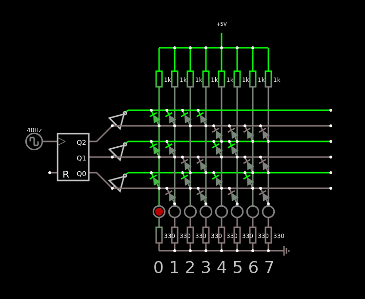

# Geração de produtos canonicos com matriz de diodos

Apenas importe para o [falstad](https://www.falstad.com/circuit/circuitjs.html) como um texto o código que está aqui: [Matriz de diodos](matrizdiodos.md)

