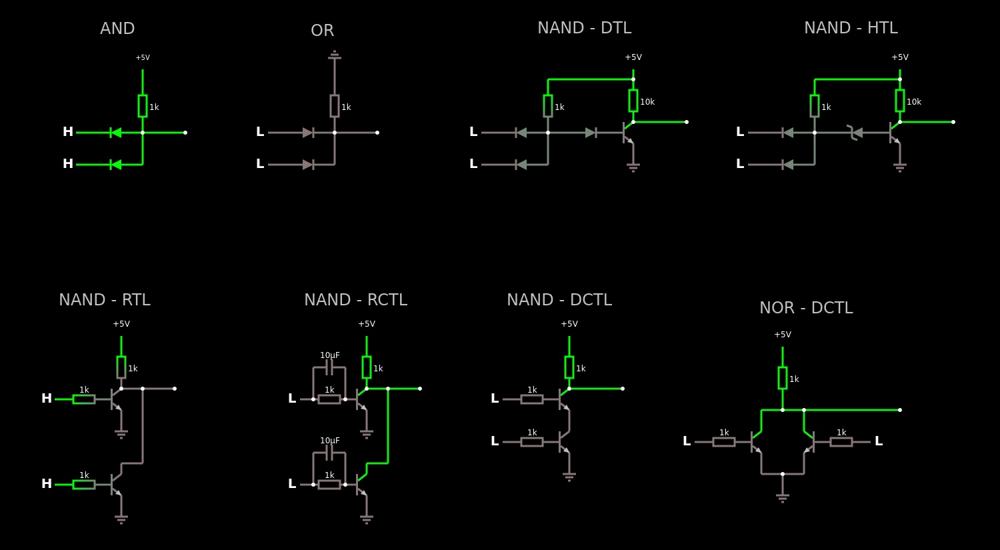

# Topologias portas lógicas

Circuito com algumas tecnologias de portas lógicas:

Apenas importe para o [falstad](https://www.falstad.com/circuit/circuitjs.html) como um texto o código abaixo:



```
$ 1 0.000005 10.20027730826997 50 5 43
R 16 48 16 16 0 0 40 5 0 0 0.5
r 16 48 16 128 0 1000
d 16 128 -64 128 2 default
d 16 176 -64 176 2 default
w 16 176 16 128 0
w 16 128 80 128 0
L -64 128 -96 128 0 1 false 5 0
L -64 176 -96 176 0 1 false 5 0
L 224 176 192 176 0 0 false 5 0
L 224 128 192 128 0 0 false 5 0
g 304 48 304 16 0
w 304 128 368 128 0
w 304 176 304 128 0
d 224 176 304 176 2 default
d 224 128 304 128 2 default
r 304 48 304 128 0 1000
L 544 176 512 176 0 0 false 5 0
L 544 128 512 128 0 0 false 5 0
w 624 128 656 128 0
w 624 176 624 128 0
d 624 176 544 176 2 default
d 624 128 544 128 2 default
r 624 48 624 128 0 1000
R 752 48 752 16 0 0 40 5 0 0 0.5
d 656 128 720 128 2 default
t 720 128 752 128 0 1 -4.448980650902892 0.47076227967174145 100
g 752 144 752 176 0
w 752 112 832 112 0
w 624 48 752 48 0
r 752 48 752 112 0 10000
x -48 -20 4 -17 4 24 AND
x 268 -17 303 -14 4 24 OR
x 608 -21 749 -18 4 24 NAND\s-\sDTL
x -110 387 27 390 4 24 NAND\s-\sRTL
w -16 512 16 512 0
g -16 672 -16 704 0
t -48 528 -16 528 0 1 0.6328844479140352 0.6574760469514397 100
R -16 448 -16 416 0 0 40 5 0 0 0.5
L -96 528 -128 528 0 1 false 5 0
L -96 656 -128 656 0 1 false 5 0
t -48 656 -16 656 0 1 0.6328844479140352 0.6574760469514397 100
w -16 624 -16 640 0
r -16 448 -16 512 0 1000
w 16 624 -16 624 0
r -96 528 -48 528 0 1000
r -96 656 -48 656 0 1000
w 1008 544 1152 544 0
w 1008 640 1008 608 0
w 976 640 1008 640 0
w 944 640 976 640 0
w 944 608 944 640 0
w 1008 544 1008 576 0
w 976 544 1008 544 0
w 944 544 944 576 0
w 976 544 944 544 0
x 941 399 1081 402 4 24 NOR\s-\sDCTL
w 976 528 976 544 0
g 976 640 976 672 0
t 912 592 944 592 0 1 -4.999999999499999 9.999999999613375e-11 100
R 976 464 976 432 0 0 40 5 0 0 0.5
L 864 592 832 592 0 0 false 5 0
L 1088 592 1120 592 0 0 false 5 0
t 1040 592 1008 592 0 1 -4.999999999499999 9.999999999613375e-11 100
r 976 464 976 528 0 1000
r 864 592 912 592 0 1000
r 1040 592 1088 592 0 1000
r 576 592 624 592 0 1000
r 576 528 624 528 0 1000
w 656 544 656 560 0
r 656 448 656 512 0 1000
w 656 560 656 576 0
t 624 592 656 592 0 1 -0.01044442555677154 3.3222591376306225e-11 100
L 576 592 544 592 0 0 false 5 0
L 576 528 544 528 0 0 false 5 0
R 656 448 656 416 0 0 40 5 0 0 0.5
t 624 528 656 528 0 1 -4.999999999732891 -0.010444425489661907 100
g 656 608 656 640 0
w 656 512 736 512 0
x 562 387 720 390 4 24 NAND\s-\sDCTL
g -16 544 -16 576 0
w 16 624 16 512 0
w 16 512 64 512 0
w 384 512 432 512 0
w 384 624 384 512 0
g 352 544 352 576 0
r 272 656 320 656 0 1000
r 272 528 320 528 0 1000
w 384 624 352 624 0
r 352 448 352 512 0 1000
w 352 624 352 640 0
t 320 656 352 656 0 1 -4.999999999500092 9.990663826734275e-11 100
L 272 656 240 656 0 0 false 5 0
L 272 528 240 528 0 0 false 5 0
R 352 448 352 416 0 0 40 5 0 0 0.5
t 320 528 352 528 0 1 -4.999999999500092 9.990663826734275e-11 100
g 352 672 352 704 0
w 352 512 384 512 0
x 258 387 413 390 4 24 NAND\s-\sRCTL
w 272 528 272 480 0
w 320 528 320 480 0
c 320 480 272 480 0 0.00001 9.990663826734275e-11
w 272 656 272 608 0
c 272 608 320 608 0 0.00001 -9.990663826734275e-11
w 320 608 320 656 0
x 1008 -21 1148 -18 4 24 NAND\s-\sHTL
r 1152 48 1152 112 0 10000
w 1024 48 1152 48 0
w 1152 112 1232 112 0
g 1152 144 1152 176 0
t 1120 128 1152 128 0 1 -4.468648411058252 0.46560435315862325 100
R 1152 48 1152 16 0 0 40 5 0 0 0.5
r 1024 48 1024 128 0 1000
d 1024 128 944 128 2 default
d 1024 176 944 176 2 default
w 1024 176 1024 128 0
w 1024 128 1056 128 0
L 944 128 912 128 0 0 false 5 0
L 944 176 912 176 0 0 false 5 0
34 zvoltage\q3.3 0 1.7143528192808883e-7 0 2 3.3
z 1120 128 1056 128 2 zvoltage\q3.3
```